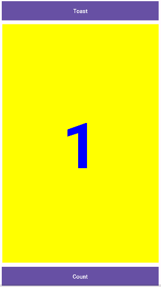

# Project-Fibonacci

Nama 	: Rico Prasetya
NIM	: 312210425
Matkul	: Pemrograman Mobile

Project Fibonacci

## 1. activity_main.xml

    <?xml version="1.0" encoding="utf-8"?>
    <androidx.constraintlayout.widget.ConstraintLayout
    xmlns:android="http://schemas.android.com/apk/res/android"
    xmlns:app="http://schemas.android.com/apk/res-auto"
    xmlns:tools="http://schemas.android.com/tools"
    android:layout_width="match_parent"
    android:layout_height="match_parent"
    tools:ignore="ExtraText"
    tools:context=".MainActivity">

    <Button
        android:id="@+id/btnToast"
        android:layout_width="0dp"
        android:layout_height="wrap_content"
        android:layout_marginEnd="8dp"
        android:layout_marginStart="8dp"
        android:layout_marginTop="8dp"
        android:background="@color/colorPrimary"
        android:onClick="showToast"
        android:text="Toast"
        android:textColor="@color/white"
        app:layout_constraintEnd_toEndOf="parent"
        app:layout_constraintStart_toStartOf="parent"
        app:layout_constraintTop_toTopOf="parent"
        />

    <Button
        android:id="@+id/button2"
        android:layout_width="0dp"
        android:layout_height="wrap_content"
        android:layout_marginStart="8dp"
        android:layout_marginTop="676dp"
        android:layout_marginEnd="8dp"
        android:background="@color/colorPrimary"
        android:onClick="countTop"
        android:text="@string/button_label_count"
        android:textColor="@color/white"
        app:layout_constraintEnd_toEndOf="parent"
        app:layout_constraintHorizontal_bias="1.0"
        app:layout_constraintStart_toStartOf="parent"
        app:layout_constraintTop_toTopOf="parent" />

    <TextView
        android:id="@+id/show_count"
        android:layout_width="395dp"
        android:layout_height="600dp"
        android:layout_marginTop="8dp"
        android:background="#FFFF00"
        android:gravity="center_vertical"
        android:text="1"
        android:textAlignment="center"
        android:textColor="#FF0000FF"
        android:textSize="160sp"
        android:textStyle="bold"
        app:layout_constraintBottom_toTopOf="@+id/button2"
        app:layout_constraintEnd_toEndOf="parent"
        app:layout_constraintStart_toStartOf="parent"
        app:layout_constraintTop_toBottomOf="@id/btnToast"
        app:layout_constraintVertical_bias="0.089"
        tools:ignore="RtlCompat" />

    </androidx.constraintlayout.widget.ConstraintLayout>

## 2. colors.xml

    <?xml version="1.0" encoding="utf-8"?>
    <resources>
    <color name="black">#FF000000</color>
    <color name="white">#FFFFFFFF</color>
    <color name="blue">#0000FF</color>
    <color name="colorPrimary">#3F51B5</color>
    <color name="colorPrimaryDark">#303F9F</color>
    <color name="colorAccent">#FF4081</color>
    </resources>

## 3. strings.xml

    <resources>
    <string name="app_name">Fibonacci Project</string>
    <string name="ApaKabar1">Hallo apa kabarnya?</string>
    <string name="button_label_toast">Toast</string>
    <string name="button_label_count">Count</string>
    <string name="count_initial_value">1</string>
    <string name="toast_message">Hebat Bro!</string>
    </resources>

## 4. MainActivity.java

    package com.example.fibonanciproject;

    import androidx.appcompat.app.AppCompatActivity;

    import android.os.Bundle;
    import android.view.View;
    import android.widget.TextView;
    import android.widget.Toast;

    public class MainActivity extends AppCompatActivity {
    private TextView show_count;
    private int count = 1;
    private long fibNMinus = 1;
    private long fibNMinus2 = 0;

    @Override
    protected void onCreate(Bundle savedInstanceState) {
        super.onCreate(savedInstanceState);
        setContentView(R.layout.activity_main);

        show_count = findViewById(R.id.show_count);
    }
    public void countTop(View view){
        if (count == 0) {
            show_count.setText("0");
        }else if (count ==1 ){
            show_count.setText("1");
        }else {
            long fibCurrent = fibNMinus + fibNMinus2;
            fibNMinus2 = fibNMinus;
            fibNMinus = fibCurrent;
            show_count.setText(String.valueOf(fibCurrent));
        }
        count++;
    }
    }

## 5. Tampilan Aplikasi

